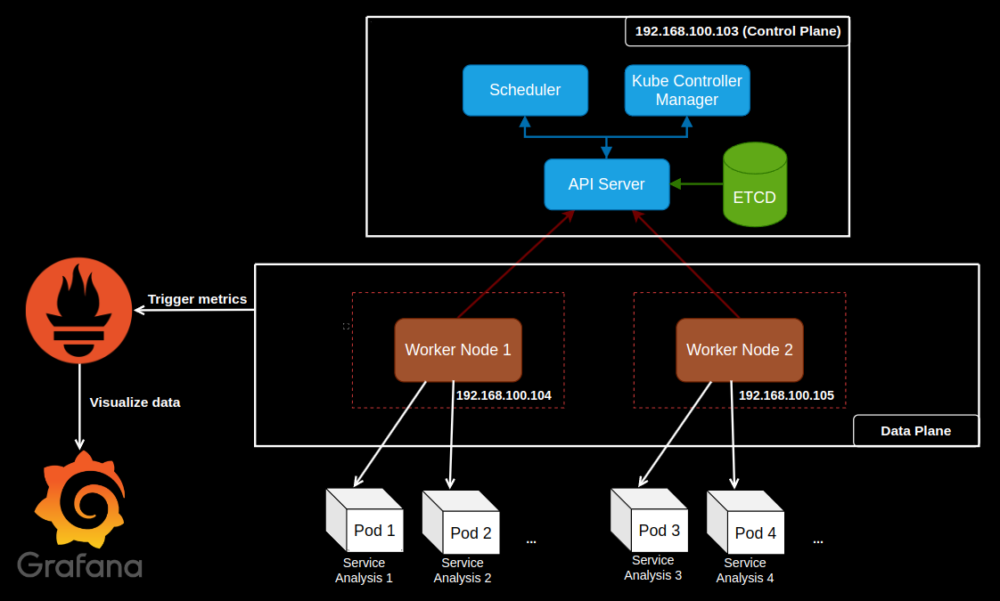
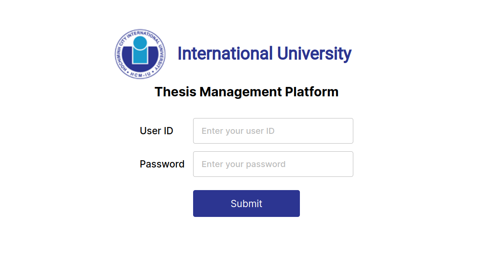

<a name="readme-top"></a>

<!-- PROJECT LOGO -->
<br />
<div align="center">
	<a href="https://hcmiu.edu.vn/en" target="_blank">
		
	</a>
  	<h2 align="center">
		INTEGRATING DEVOPS AND NATURAL LANGUAGE PROCESSING 
        TO STREAMLINE THESIS MANAGEMENT
	</h2>
	<p>
		This is the CI Pipeline Repository. For the CD Pipeline, check it out <a href="https://github.com/Nhathuy1305/Thesis-Report-Management-System-CD">here</a>.
	</p>
</div>

<!-- ABOUT THE PROJECT -->

## 1. About The Project

The current thesis report system at universities lacks advanced tools for content analysis and grammar detection, which are limited to faculty and difficult to integrate. This leads to errors and inefficiencies, especially during peak submission times.

I propose a new system that standardizes content analysis, grammar correction, and format validation, accessible to both students and faculty. This would reduce faculty workload and improve the quality of student work.

Such a system would create a fair academic environment, providing essential resources and enabling timely feedback.

#### 1.1. Features
This system consists of:
<ul>
	<li>
		A thesis submission point that allows for multiple attempts.
	</li>
	<li>
		Evaluation services that generate comprehensive feedback based on the provided thesis writing guidelines.
	</li>
	<li>
		An interface that displays information of the thesis document with their visualized evaluation, customized based on the user role.
	</li>
    <li>
        Automate the build, test, and deployment process for the application services.
    </li>
    <li>
        Automate the deployment and management of application services on Kubernetes clusters.
    </li>
    <li>
        Perform running application services on the infrastructure (virtual machines).
    </li>
    <li>
        Collects and visualizes metrics about application performance and health.
    </li>
</ul>

#### 1.2. Built With

The primary tools that are used to develop this application are:
- Node.js
- Express.js
- React
- RabbitMQ
- Python libraries
- PostgreSQL
- Google Cloud Storage

<br>

The Open-source tools that are used to handle the CI/CD, Automation Test, Orchestration, Operating, Monitoring are:
- Docker
- Jenkins
- Sonarqube
- Trivy
- ArgoCD
- Kubernetes
- Prometheus
- Grafana

<!-- GETTING STARTED -->

## 2. Getting Started

To set up and run the project locally, the following prerequisites should be satisfied before moving to the installation steps.

#### 2.1. Prerequisites

Make sure the tools below are installed. The instructions are given based on different operating systems:
- Docker: Encapsulates the dependencies that are needed to run the application (https://docs.docker.com/get-docker)
- Git: Allows for cloning of this repository (https://git-scm.com/book/en/v2/Getting-Started-Installing-Git)

#### 2.2. Installation

1. Clone the repository.
```sh
git clone https://github.com/Nhathuy1305/Thesis-Report-Management-System-CI.git
```
2. Create a Google Cloud Storage bucket named <a>thesis_file_bucket</a>.
3. Upload the <a>requirements</a> folder to this bucket.
4. Copy your Google Cloud credentials to <a>google_credentials.json</a>.
5. Edit the submission deadline to your preferred date at line 193 of <a>/postgresql/init.sql</a>. It is recommended that this value should be after the current date on your system, otherwise, submission will be closed.
```sh
INSERT INTO public.deadline (deadline) VALUES (deadline);
```
6. cd to the file path of this project.
```sh
cd file_path
```
7. Run Docker compose command.
```sh
docker-compose up -d
```
8. If you want to stop the program.
```sh
docker-compose down
```

<!-- ARCHITECTURE -->

## 3. ARCHITECTURE

Before we can begin any action, we must identify all of the system's needs and its architecture. These are alterations to the system's structure so that all the best solutions are performed in detail.

#### 3.1. Use Case Diagram

<p align="center">
  
</p>
The student and teacher, the derivatives of the actor, are some of the system's main characters. They have a few singular activities but can also be exchanged for others. 

#### 3.2. Simplified System Architecture

<p align="center">
  
</p>
The client-side provides an interface for entering data and seeing results. A REST API that answers such queries sends and processes messages to the message broker. Messages are routed and forwarded to the analysis services via the message broker. To save and retrieve the results, these services and the REST API have access to the file system.

#### 3.3. Simplified Event-driven Architecture

<p align="center">
  
</p>
The system comprises RabbitMQ for event brokering, various services as event producers (e.g., Format Checking and Grammar Detection), and event consumers that process and validate theses, with PostgreSQL for secure data storage.

#### 3.4. Event-driven Microservices Architecture

<p align="center">
  
</p>
The system uses RabbitMQ for message brokering, connecting modular services via a REST API built with Express.js, which handles client interactions and database integration for user data and metadata storage. Google Cloud Storage manages larger files, while RabbitMQ facilitates communication through fanout and direct exchanges, distributing tasks to various analysis services operating independently. Data flows from the REST API through RabbitMQ to analysis services, with outputs stored in Google Cloud Storage or returned to clients.

#### 3.5. Database Design

<p align="center">
  
</p>
Data management is crucial for any system, starting with a well-organized database to ensure speed and functionality. This system uses a relational database architecture to support complex queries, such as a teacher viewing all thesis submissions by students. There are two primary database structures: one for analytical services and one for the REST APIs (Express.js).

#### 3.6. Git Workflow

<p align="center">
  
</p>
The updates in Git trigger the automated build and push of container images to a registry. DevOps tooling synchronizes these updates with the Kubernetes cluster.

#### 3.7. CI/CD Pipeline and Cluster Layers

<p align="center">
  
</p>
Continuous Integration (CI) and Continuous Deployment (CD) are managed using Jenkins, with ArgoCD automatically monitoring and deploying changes to the Kubernetes cluster. Prometheus and Grafana handle monitoring, providing real-time insights into the application's performance and health. Code quality is ensured through SonarQube during the CI process.

#### 3.8. Kubernetes Cluster

<p align="center">
  
</p>
It is a system broken down into smaller components, each of which can act independently and has a specific role. Such an approach is modular, which means it can be developed, deployed, and scaled independently. This means we can change the service without changing the whole system.

Docker containerization packages all dependencies, the runtime environment, and the code for each microservice. It ensures that each environment consistently executes the same way anywhere, making deployment and maintenance easier.


<!-- USAGE EXAMPLES -->

## 4. Usage

Access <a href="http://localhost:3000" target="_blank">http://localhost:3000</a> on your browser. Sign in with any student ID, instructor ID or admin ID given in the <a>/postgresql/init.sql</a> file.

Examples:
- Student ID: ITITIU20043
- Instructor ID: ITITEACH001
- Admin ID: ITITADMIN01

<p align="center">
  
</p>

Provide inputs to the thesis submission form.

<p align="center">
  
</p>

Select any service on the left-hand navigation area to view the evaluation.
<p align="center">
  
</p>
<p align="center">
  
</p>

Options to download the thesis document, services' results, viewing the guidelines and resubmission are available.
<p align="center">
  
</p>

Instructors can view the thesis reports and evaluations of students they supervise and give manual feedback.
<p align="center">
  
</p>
<p align="center">
  
</p>

Admins can edit the deadline, access the list of student submissions, send notifications to students and instructors.
<p align="center">
  
</p>

<!-- EVALUATION -->

## 5. Evaluation

<p align="center">
  
</p>
The chart above illustrates the performance of the Kubernetes node across three different tests, comparing the total response time and throughput as the number of requests increases from 100 to 100,000. While the total time increases with the number of requests, the throughput also substantially rises, indicating the node's effective scaling and handling capabilities under varying loads.

<br>

<p align="center">
  
</p>
I performed on all the Python services, precisely its upload functionality in this part. I sent ten reports from each user to the system. The CPU utilization of node 3 (worker 2) peaked at approximately 97.3%. The controller node was crucial in this scenario, facilitating data distribution between workers one and 2. This spike in CPU usage, depicted in the graph, reflects the system's response to the increased workload, underscoring the effectiveness of the controller node in managing and balancing the load between the worker nodes.

<!-- FUTURE WORK -->

## 6. Future Work
The architecture used to develop this system allows for ease of updating, adding or removing services due to loose coupling. 

New services can be added with the following steps. For example, a service that detects and checks figure captions: 
- Copy a folder of any service and assign it a new name, for example "figure_caption_check". 
- Add the information for this service in the <a>docker-compose.yml</a> file. 
- Add a table for it in <a>/postgresql/init.sql</a>. 
- Update the name of this service in the client's environment variable.
```sh
REACT_APP_SERVICE_LIST: "...,figure_caption_check"
```
- Update the name of this service in the backend's environment variable.
```sh
SERVICE_LIST: "...,figure_caption_check"
```
- If needed, add a requirement (guidelines) file for the service by uploading to its file path <a>/requirements/figure_caption_check/requirement.txt</a> in the cloud storage bucket.
```sh
# example requirement.txt
Figure num.num. Text text text
Correct: Figure 1.1. Tech stack
Incorrect: Figure 1-1 tech stack, Picture 1. Tech stack, 
No figure caption...
```
- The main algorithm can then be updated in <a>/figure_caption_check/processor.py</a>.

<!-- CONTACT -->

## 7. Contact

- LinkedIn: https://www.linkedin.com/in/nhathuy1305
- Email: dangnhathuy.work@gmail.com

<!-- ACKNOWLEDEGMENT -->

## 8. Acknowledgement
I would like to use this opportunity to thank Dr. Tran Thanh Tung from the bottom of my heart. His advice has been crucial throughout my thesis assignment. His insightful advice pushed me to develop my work in a much stronger direction, and I couldn't have done it without him.

I also want to thank the School of Computer Science and Engineering at the International University. The fundamental information covered in the curriculum gives me the confidence to carry out this study. It has been a pleasant experience, and I was able to participate in the Computer Science program and learn from experienced lecturers.
